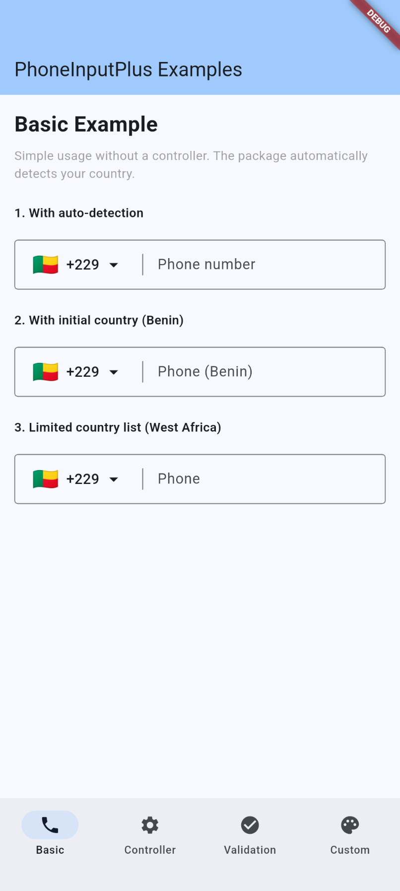
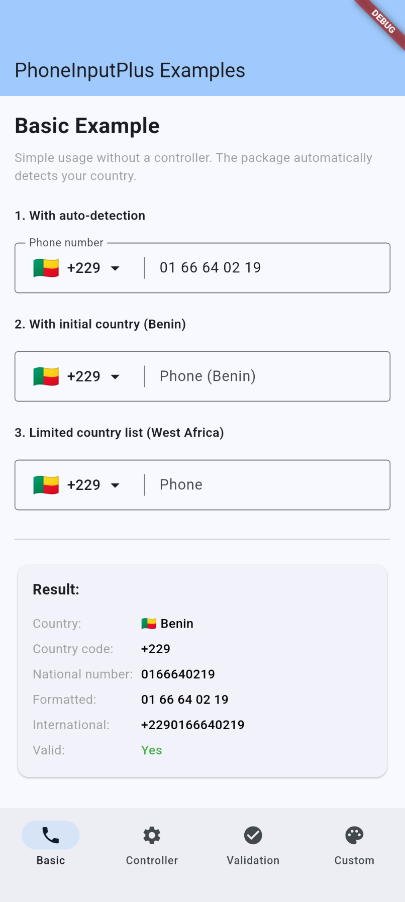
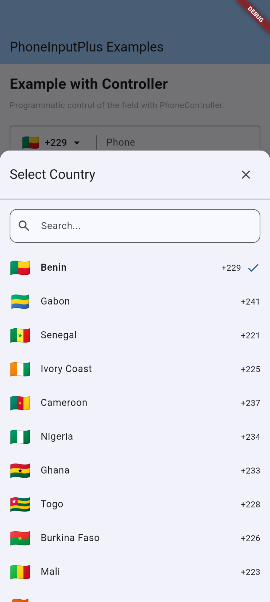
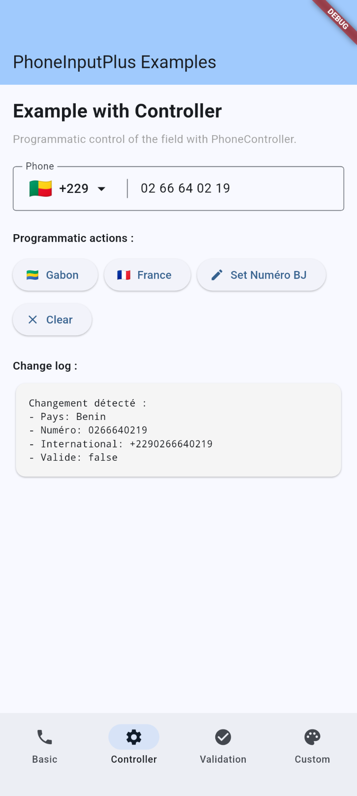
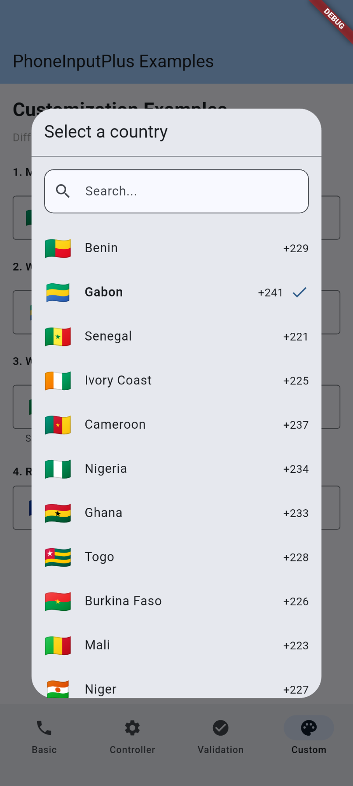
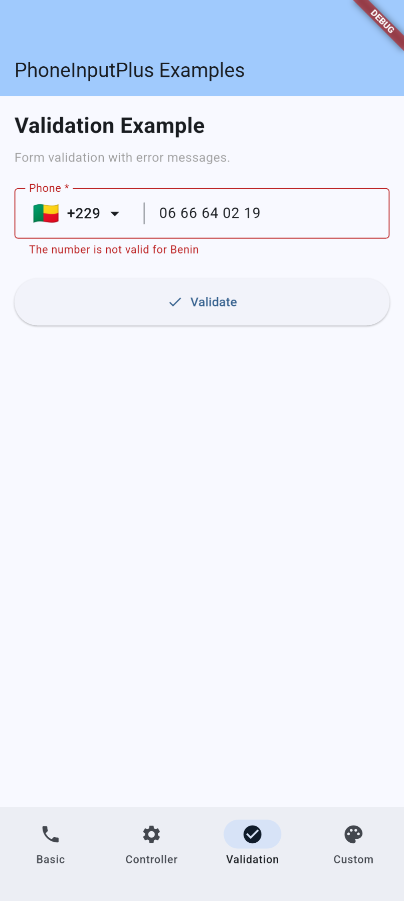

# 📱 phone_input_plus

A customizable Flutter phone input field with automatic country detection, smart formatting, and validation. Perfect for African and international phone numbers.

[](https://pub.dev/packages/phone_input_plus)
[](https://pub.dev/packages/phone_input_plus/score)
[](https://pub.dev/packages/phone_input_plus/score)
[](https://pub.dev/packages/phone_input_plus/score)
[](https://opensource.org/licenses/MIT)

## ✨ Features

-  **Auto Country Detection** - Detects user's country via IP or device locale
-  **Smart Formatting** - Real-time number formatting as you type
-  **Built-in Validation** - Country-specific phone number validation
-  **Highly Customizable** - Extensive styling and configuration options
-  **54 African Countries** - Optimized for African phone numbers
-  **International Support** - Works worldwide with any country
-  **Multiple Selector Types** - BottomSheet, Dialog, or Full Page
-  **Search Functionality** - Quick country search with multi-language support
-  **Smart Caching** - Caches detected country for better performance
-  **Controller Support** - Full programmatic control like TextField

## 📸 Screenshots

<table>
  <tr>
    <td></td>
    <td></td>
    <td></td>
    <td></td>
    <td></td>
    <td></td>
  </tr>
  <tr>
    <td text-align="center">Basic</td>
    <td text-align="center">Basic Example</td>
    <td text-align="center">BottomSheet Country</td>
    <td text-align="center">Controller Example</td>
    <td text-align="center">Dialog Country</td>
    <td text-align="center">Validation Example</td>
  </tr>
</table>

## 🚀 Getting Started

### Installation

Add this to your `pubspec.yaml`:
```yaml
dependencies:
  phone_input_plus: ^0.0.1
```

Then run:
```bash
flutter pub get
```

### Import
```dart
import 'package:phone_input_plus/phone_input_plus.dart';
```

## 💡 Basic Usage

### Simple Phone Input

The most basic usage with auto country detection:
```dart
PhoneInputField(
  decoration: const InputDecoration(
    labelText: 'Phone Number',
    border: OutlineInputBorder(),
  ),
  onChanged: (PhoneNumber phone) {
    print('International: ${phone.international}');
    print('Valid: ${phone.isValid}');
  },
)
```

### With Initial Country

Set a specific initial country:
```dart
PhoneInputField(
  initialCountry: CountryData.benin,
  autoDetect: false, // Disable auto-detection
  decoration: const InputDecoration(
    labelText: 'Phone Number',
    border: OutlineInputBorder(),
  ),
)
```

### Limited Country List

Restrict to specific countries (e.g., West Africa only):
```dart
PhoneInputField(
  countries: const [
    CountryData.benin,
    CountryData.gabon,
    CountryData.senegal,
    CountryData.coteDivoire,
    CountryData.cameroon,
  ],
  decoration: const InputDecoration(
    labelText: 'Phone Number',
    border: OutlineInputBorder(),
  ),
)
```

## 🎯 Advanced Usage

### Using PhoneController

For programmatic control, use `PhoneController`:
```dart
class MyWidget extends StatefulWidget {
  @override
  State<MyWidget> createState() => _MyWidgetState();
}

class _MyWidgetState extends State<MyWidget> {
  late PhoneController _controller;

  @override
  void initState() {
    super.initState();
    _controller = PhoneController(
      initialCountry: CountryData.benin,
    );
    
    // Listen to changes
    _controller.addListener(() {
      print('Phone changed: ${_controller.international}');
    });
  }

  @override
  void dispose() {
    _controller.dispose();
    super.dispose();
  }

  @override
  Widget build(BuildContext context) {
    return Column(
      children: [
        PhoneInputField(
          controller: _controller,
          decoration: const InputDecoration(
            labelText: 'Phone Number',
            border: OutlineInputBorder(),
          ),
        ),
        
        // Programmatic actions
        ElevatedButton(
          onPressed: () => _controller.changeCountry(CountryData.france),
          child: const Text('Switch to France'),
        ),
        ElevatedButton(
          onPressed: () => _controller.clear(),
          child: const Text('Clear'),
        ),
      ],
    );
  }
}
```

### Form Validation

Integrate with Flutter forms:
```dart
Form(
  key: _formKey,
  child: PhoneInputField(
    decoration: const InputDecoration(
      labelText: 'Phone Number *',
      border: OutlineInputBorder(),
    ),
    validator: (phone) {
      if (phone == null || phone.isEmpty) {
        return 'Phone number is required';
      }
      if (!phone.isValid) {
        return 'Invalid phone number for ${phone.country.nameEn}';
      }
      return null;
    },
    onSubmitted: (phone) {
      if (_formKey.currentState!.validate()) {
        // Submit form
      }
    },
  ),
)
```

## 🌍 Country Detection

The package automatically detects the user's country using multiple strategies:

1. **IP-based detection** (primary) - Uses free IP geolocation APIs
2. **Device locale** (fallback) - Uses the device's locale settings
3. **Smart caching** - Caches the detected country for 24 hours

### Disable Auto-Detection
```dart
PhoneInputField(
  autoDetect: false,
  initialCountry: CountryData.benin,
)
```

### Custom Cache Duration
```dart
PhoneInputField(
  detectionCacheDuration: 48, // Cache for 48 hours
)
```

## ✅ Validation

### Built-in Validation

Each country has specific validation rules:
```dart
final phone = PhoneNumber(
  country: CountryData.benin,
  nationalNumber: '0166640219',
);

print(phone.isValid); // true - valid Benin number
print(phone.formatted); // "01 66 64 02 19"
print(phone.international); // "+2290166640219"
```

### Custom Validator

Add your own validation logic:
```dart
PhoneInputField(
  validator: (phone) {
    if (phone == null || phone.isEmpty) {
      return 'Required';
    }
    
    // Custom rule: Only mobile numbers
    if (phone.country.code == 'FR' && 
        !phone.nationalNumber.startsWith('6') &&
        !phone.nationalNumber.startsWith('7')) {
      return 'Only mobile numbers allowed';
    }
    
    if (!phone.isValid) {
      return 'Invalid number';
    }
    
    return null;
  },
)
```

## 🎨 Customization

### Country Button Style

Customize the country selector button:
```dart
PhoneInputField(
  countryButtonStyle: const CountryButtonStyle(
    showDialCode: false, // Hide dial code
    padding: EdgeInsets.all(8),
    flagStyle: TextStyle(fontSize: 32), // Bigger flag
  ),
)
```

### Country Selector Type

Choose between BottomSheet, Dialog, or Page:
```dart
PhoneInputField(
  countrySelectorConfig: const CountrySelectorConfig(
    type: CountrySelectorType.dialog, // or .bottomSheet, .page
    title: 'Choose Country',
    searchHint: 'Search...',
    locale: 'fr', // Show country names in French
  ),
)
```

### Disable Auto-Formatting

Show raw numbers without spaces:
```dart
PhoneInputField(
  autoFormat: false,
)
```

### Custom Decoration

Full control over the TextField appearance:
```dart
PhoneInputField(
  decoration: InputDecoration(
    labelText: 'Mobile',
    hintText: 'Enter your number',
    prefixIcon: const Icon(Icons.phone),
    border: OutlineInputBorder(
      borderRadius: BorderRadius.circular(12),
    ),
    filled: true,
    fillColor: Colors.grey[100],
  ),
)
```

## 📚 Available Countries

### Quick Access
```dart
// Individual countries
CountryData.benin
CountryData.gabon
CountryData.senegal
CountryData.coteDivoire
CountryData.cameroon
CountryData.france
CountryData.usa
// ... and more

// Lists
CountryData.allCountries // All available countries
CountryData.africanCountries // All African countries
CountryData.africanPlusMajor // African + France + USA
```

### Search Countries
```dart
// Search by name (English)
final results = CountryData.search('Benin');

// Search by name (French)
final results = CountryData.search('Bénin', locale: 'fr');

// Get country by code
final benin = CountryData.getByCode('BJ');

// Get country by dial code
final benin = CountryData.getByDialCode('+229');
```

## 🔧 API Reference

### PhoneInputField

| Parameter          | Type               | Default       | Description                                      |
|--------------------|--------------------|---------------|--------------------------------------------------|
| `controller`       | `PhoneController?` | `null`        | Optional controller for programmatic control     |
| `initialCountry`   | `Country?`         | `null`        | Initial country (ignored if controller provided) |
| `countries`        | `List<Country>`    | All countries | List of available countries                      |
| `autoDetect`       | `bool`             | `true`        | Auto-detect user's country                       |
| `autoFormat`       | `bool`             | `true`        | Format number as user types                      |
| `validator`        | `Function?`        | `null`        | Custom validation function                       |
| `onChanged`        | `Function?`        | `null`        | Callback when number changes                     |
| `onCountryChanged` | `Function?`        | `null`        | Callback when country changes                    |
| `decoration`       | `InputDecoration?` | `null`        | TextField decoration                             |
| `enabled`          | `bool`             | `true`        | Enable/disable the field                         |
| `readOnly`         | `bool`             | `false`       | Make field read-only                             |

### PhoneController

| Method                   | Description                     |
|--------------------------|---------------------------------|
| `changeCountry(Country)` | Change the selected country     |
| `updateNumber(String)`   | Update the phone number         |
| `clear()`                | Clear the number (keep country) |
| `reset(Country)`         | Reset with new country          |

| Getter           | Type      | Description                    |
|------------------|-----------|--------------------------------|
| `country`        | `Country` | Current country                |
| `nationalNumber` | `String`  | National number (no dial code) |
| `international`  | `String`  | Full international number      |
| `formatted`      | `String`  | Formatted number               |
| `isValid`        | `bool`    | Is number valid?               |

### PhoneNumber

| Property         | Type      | Description          |
|------------------|-----------|----------------------|
| `country`        | `Country` | The country          |
| `nationalNumber` | `String`  | National number      |
| `international`  | `String`  | International format |
| `formatted`      | `String`  | Formatted display    |
| `isValid`        | `bool`    | Validation status    |

## 🤝 Contributing

Contributions are welcome! Please feel free to submit a Pull Request.

### Adding More Countries

To add support for additional countries, edit `lib/src/core/data/countries_*.dart` files.

## 📄 License

This project is licensed under the MIT License - see the [LICENSE](LICENSE) file for details.

## 💬 Support

For issues, questions, or feature requests, please [open an issue](https://github.com/JoshuaAivodji/phone_input_plus/issues).

---

Made with ❤️ in Benin 🇧🇯